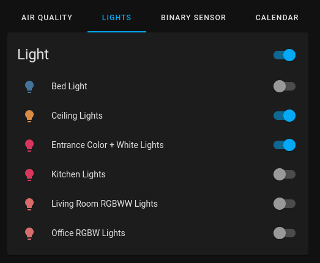
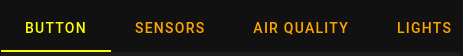

# Tabbed Card

A custom card for home assistant that utilizes tabs to segregate individual cards.



## Installation

[](https://github.com/hacs/integration)

Use [HACS](https://hacs.xyz) or follow this [guide](https://github.com/thomasloven/hass-config/wiki/Lovelace-Plugins)

## Eample

```yaml
type: custom:tabbed-card
tabs:
  - label: Air
    card:
      type: entities
      title: Air Quality
      entities:
        - air_quality.demo_air_quality_home
        - air_quality.demo_air_quality_office
  - label: Grid
    card:
      type: grid
      square: false
      columns: 1
      cards:
        - type: humidifier
          entity: humidifier.dehumidifier
        - type: humidifier
          entity: humidifier.humidifier
        - type: humidifier
          entity: humidifier.hygrostat
  - label: Button
    card:
      type: button
      entity: light.bed_light
      tap_action:
        action: toggle
      show_name: true
      show_icon: true
      show_state: true
```

<!-- TODO: options -->
<!-- ## Options -->

## Styling

This card tries to closely match home assistants default tab styles. You can override and apply additional styling to the card via provided material web components custom properties.

### Default Custom Properties

| Name                                 | Default                    | Description                                                                                                                                                    |
| ------------------------------------ | -------------------------- | -------------------------------------------------------------------------------------------------------------------------------------------------------------- |
| `--mdc-theme-primary`                | `--primary-text-color`     | Color of the activated tab's text, indicator, and ripple.                                                                                                      |
| `--mdc-tab-text-label-color-default` | `rgba(225, 225, 225, 0.8)` | Color of an unactivated tab label. **_If you want transpareny on the unactivated tabs, you need to use an `rgba` value incorporating the 4th alpha channel._** |
| `--mdc-typography-button-font-size`  | `14px`                     | Font size of the tab label.                                                                                                                                    |



```yaml
type: custom:tabbed-card
styles:
  --mdc-theme-primary: yellow
  --mdc-tab-text-label-color-default: orange
tabs: ...
```

See the full list of exposed custom properties: [`<mwc-tab>`](https://github.com/material-components/material-web/blob/mwc/packages/tab/README.md#css-custom-properties)

<!-- TODO: implement customizing tabs attributes -->
<!-- TODO: credits -->
