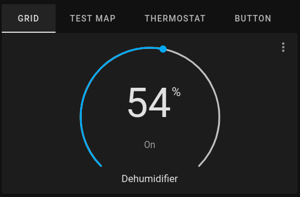
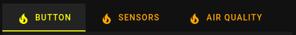
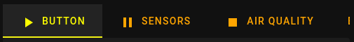

# Tabbed Card

A custom card for home assistant that utilizes tabs to segregate individual cards.

⚠️ CURRENTLY ONLY LOOKS ACCEPTABLE IN DARK MODE ⚠️



## Installation

[](https://github.com/hacs/integration)

Use [HACS](https://hacs.xyz) or follow this [guide](https://github.com/thomasloven/hass-config/wiki/Lovelace-Plugins)

## Card Schema

```yaml
type: custom:tabbed-card
options?:
  defaultTabIndex?: number
styles?:
attributes?:
  label?: string
  icon?: string
  isFadingIndicator?: boolean
  minWidth?: boolean
  isMinWidthIndicator?: boolean
  stacked?: boolean
tabs:
  - card:
      type:
    styles?:
    attributes?:
      label?: string
      icon?: string
      isFadingIndicator?: boolean
      minWidth?: boolean
      isMinWidthIndicator?: boolean
      stacked?: boolean
```

### Eample

```yaml
- type: custom:tabbed-card
  tabs:
    - card:
        type: button
        entity: light.bed_light
        tap_action:
          action: toggle
        show_name: true
        show_icon: true
        show_state: true
      attributes:
        label: Button
    - card:
        type: entities
        title: Air Quality
        entities:
          - air_quality.demo_air_quality_home
          - air_quality.demo_air_quality_office
      attributes:
        label: Air Quality
    - card:
        type: entities
        title: Binary sensor
        entities:
          - binary_sensor.basement_floor_wet
          - binary_sensor.movement_backyard
      attributes:
        label: Binary Sensor
    - card:
        type: entities
        title: Calendar
        entities:
          - entity: calendar.calendar_1
            name: "1"
          - entity: calendar.calendar_2
            name: "2"
      attributes:
        label: Calendar
```

## Configuration

You can apply global and per tab configuration to your card. Global configuration(top level properties) are expressed on all tabs in your card. You can also set local configuration, per tab styles and attributes that take precedence over any corresponding global configuration.

### **Options**

| Property          | Default | Description                    |
| ----------------- | ------- | ------------------------------ |
| `defaultTabIndex` | `0`     | tab to display on first render |

```yaml
type: custom:tabbed-card
options:
  defaultTabIndex: 1 # in a 0 based index, the second tab would be the active tab on render
tabs: ...
```

### **Styling**

This card tries to closely match home assistants default tab styles. You can override and apply additional styling to the card via provided material web components custom properties.

Default Custom Properties:

| Name                                 | Default                    | Description                                                                                                                                                    |
| ------------------------------------ | -------------------------- | -------------------------------------------------------------------------------------------------------------------------------------------------------------- |
| `--mdc-theme-primary`                | `--primary-text-color`     | Color of the activated tab's text, indicator, and ripple.                                                                                                      |
| `--mdc-tab-text-label-color-default` | `rgba(225, 225, 225, 0.8)` | Color of an unactivated tab label. **_If you want transpareny on the unactivated tabs, you need to use an `rgba` value incorporating the 4th alpha channel._** |
| `--mdc-typography-button-font-size`  | `14px`                     | Font size of the tab label.                                                                                                                                    |

```yaml
type: custom:tabbed-card
styles: # global styles applied to all tabs
  --mdc-theme-primary: yellow
  --mdc-tab-text-label-color-default: orange
tabs: ...
```


See the full list of exposed custom properties: [`<mwc-tab>`](https://github.com/material-components/material-web/blob/mwc/packages/tab/README.md#css-custom-properties)

### **Attributes**

| Name                  | Default | Description                                                     |
| --------------------- | ------- | --------------------------------------------------------------- |
| `label`               | `""`    | Text label to display in tab.                                   |
| `icon`                | `""`    | Home Assistant `mdi:icon` name.                                 |
| `isFadingIndicator`   | `false` | Indicator fades in and out instead of sliding.                  |
| `minWidth`            | `false` | Shrinks tab as narrow as possible without causing text to wrap. |
| `isMinWidthIndicator` | `false` | Shrinks indicator to be the size of the content.                |
| `stacked`             | `false` | Stacks icon on top of label text.                               |

Global attributes:

```yaml
type: custom:tabbed-card
styles:
  ...
attributes:
  icon: mdi:fire # global attribute applied to all tabs
tabs:
  - attributes:
      label: Button
    card:
      type: button
      entity: light.bed_light
      tap_action:
        action: toggle
      show_name: true
      show_icon: true
      show_state: true
  ...
```



Local attributes:

```yaml
type: custom:tabbed-card
styles: ...
tabs:
  - attributes:
      label: Button # local attributes that apply only to individual tabs
      icon: mdi:play
    card:
      type: button
      entity: light.bed_light
      tap_action:
        action: toggle
      show_name: true
      show_icon: true
      show_state: true
  - attributes:
      label: Sensors
      icon: mdi:pause
    card:
      type: entities
      title: Sensor
      entities:
        - sensor.carbon_dioxide
        - sensor.carbon_monoxide
        - sensor.outside_humidity
        - sensor.outside_temperature
        - sensor.power_consumption
        - sensor.today_energy
  - attributes:
      label: Air Quality
      icon: mdi:stop
    card:
      type: entities
      title: Air Quality
      entities:
        - air_quality.demo_air_quality_home
        - air_quality.demo_air_quality_office
```



## Appreciation

Thanks for the support and services provided  [Home Assistant](https://www.home-assistant.io/),  [HACS](https://hacs.xyz/) and  [lit](https://lit.dev/) 🥰 Aslo, thanks to the [swipe-card](https://github.com/bramkragten/swipe-card) for inspiration and all of the other open source cards/projects as references.
